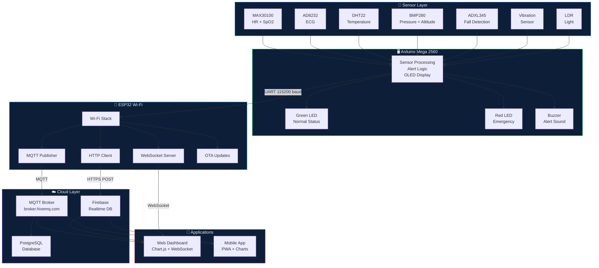

# System Architecture

## Smart IoT-Based Health Monitoring & Emergency Alert System

---

## Architecture Overview

```
┌─────────────────────────────────────────────────────────────────────┐
│                        SENSOR LAYER                                 │
│                                                                     │
│  ┌──────────┐  ┌──────────┐  ┌──────────┐  ┌──────────┐           │
│  │ MAX30100 │  │  AD8232  │  │  DHT22   │  │  BMP280  │           │
│  │ HR+SpO2  │  │   ECG    │  │  Temp    │  │ Pressure │           │
│  └────┬─────┘  └────┬─────┘  └────┬─────┘  └────┬─────┘           │
│       │ I2C         │ A0          │ D2           │ I2C             │
│  ┌────┴─────┐  ┌────┴─────┐  ┌───┴──────┐  ┌───┴──────┐          │
│  │ ADXL345  │  │Vibration │  │   LDR    │  │  OLED    │          │
│  │  Fall    │  │ Sensor   │  │  Light   │  │ Display  │          │
│  └────┬─────┘  └────┬─────┘  └────┬─────┘  └────┬─────┘          │
│       │ I2C         │ D3          │ A1           │ I2C             │
└───────┼─────────────┼─────────────┼──────────────┼─────────────────┘
        │             │             │              │
┌───────▼─────────────▼─────────────▼──────────────▼─────────────────┐
│                    PROCESSING LAYER                                  │
│                                                                      │
│                   ┌────────────────────┐                            │
│                   │  ARDUINO MEGA 2560 │                            │
│                   │                    │                            │
│                   │  • Sensor polling  │                            │
│                   │  • Data fusion     │                            │
│                   │  • Alert logic     │                            │
│                   │  • OLED control    │                            │
│                   │  • LED / Buzzer    │                            │
│                   │  • JSON serialize  │                            │
│                   └────────┬───────────┘                            │
│                            │ UART Serial1 (115200 baud)             │
│                            │ (with 5V→3.3V level shifter)          │
│                   ┌────────▼───────────┐                            │
│                   │     ESP32 Wi-Fi    │                            │
│                   │                    │                            │
│                   │  • UART receive    │                            │
│                   │  • Wi-Fi connect   │                            │
│                   │  • MQTT publish    │                            │
│                   │  • WebSocket srv   │                            │
│                   │  • HTTP POST       │                            │
│                   │  • OTA updates     │                            │
│                   └────────┬───────────┘                            │
└────────────────────────────┼────────────────────────────────────────┘
                             │ TCP/IP over Wi-Fi (802.11 b/g/n)
┌────────────────────────────▼────────────────────────────────────────┐
│                    CONNECTIVITY LAYER                                │
│                                                                      │
│   ┌────────────────────────────────────────────────────────────┐    │
│   │          MQTT Broker (HiveMQ / Local Mosquitto)            │    │
│   │    Topic: smarthealth/vitals                               │    │
│   │    Topic: smarthealth/alerts                               │    │
│   │    Topic: smarthealth/device/status                        │    │
│   └───────┬───────────────────────────────────┬───────────────┘    │
│           │                                   │                     │
│   ┌───────▼───────┐                  ┌────────▼──────────┐         │
│   │ WebSocket :81 │                  │  REST API / HTTP  │         │
│   │ (Live Push)   │                  │ (Firebase / Cloud)│         │
│   └───────┬───────┘                  └────────┬──────────┘         │
└───────────┼──────────────────────────────────-┼────────────────────┘
            │                                   │
┌───────────▼───────────────────────────────────▼────────────────────┐
│                    APPLICATION LAYER                                 │
│                                                                      │
│  ┌─────────────────────┐     ┌─────────────────────────────────┐    │
│  │    WEB DASHBOARD    │     │         CLOUD DATABASE          │    │
│  │ dashboard/index.html│     │  PostgreSQL / Firebase RTDB     │    │
│  │                     │     │                                 │    │
│  │ • Chart.js charts   │     │  Tables:                        │    │
│  │ • Real-time ECG     │     │  • vital_readings               │    │
│  │ • Alert history     │     │  • ecg_data                     │    │
│  │ • History view      │     │  • fall_events                  │    │
│  │ • Settings panel    │     │  • alerts                       │    │
│  └─────────────────────┘     │  • devices                      │    │
│                              │  • patients                     │    │
│  ┌─────────────────────┐     └─────────────────────────────────┘    │
│  │    MOBILE APP       │                                             │
│  │ mobile-app/index.html│                                            │
│  │                     │                                            │
│  │ • Monitor tab       │                                            │
│  │ • Alerts tab        │                                            │
│  │ • History tab       │                                            │
│  │ • Profile tab       │                                            │
│  │ • SOS button        │                                            │
│  └─────────────────────┘                                            │
└─────────────────────────────────────────────────────────────────────┘
```

---

## Mermaid Architecture Diagram



---

## Component Roles

| Component       | Role                                                               |
|-----------------|--------------------------------------------------------------------|
| Arduino Mega    | Primary MCU: sensor reading, alert logic, OLED, LEDs, buzzer     |
| ESP32           | IoT gateway: Wi-Fi, MQTT, WebSocket, HTTP, OTA updates            |
| MAX30100        | Photoplethysmography (PPG) for heart rate and blood oxygen        |
| AD8232          | Single-lead ECG signal amplification                              |
| DHT22           | Ambient + body temperature and humidity sensing                   |
| BMP280          | Barometric pressure and altitude (BMP280 ±1 hPa accuracy)        |
| ADXL345         | 3-axis accelerometer for fall detection algorithm                 |
| Vibration Sensor| SW-420: detects abnormal mechanical vibrations                    |
| LDR             | Ambient light level (ward lighting condition monitoring)          |
| OLED (SSD1306)  | Local display: vitals, status, emergency messages                 |
| Green LED       | Visual indicator: normal system status                            |
| Red LED         | Visual indicator: emergency / alert condition                     |
| Buzzer          | Audio alert: beep pattern on emergency trigger                    |

---

## Data Flow Rates

| Data Type     | Rate     | Protocol           |
|---------------|----------|--------------------|
| Vitals (HR, SpO2, Temp, etc.) | 1 Hz | UART → MQTT/WS |
| ECG Samples   | 5 Hz (batched) | UART → WS  |
| OLED Update   | 2 Hz     | Local I2C          |
| MQTT Heartbeat| 0.033 Hz | MQTT               |
| Database Write| 1 Hz     | HTTP REST / MQTT   |

---

## Security Considerations

- **MQTT:** Use TLS (port 8883) in production with certificate-based auth
- **Firebase:** Use Firebase Auth tokens, not database secrets
- **OTA:** Password-protected ArduinoOTA (configurable)
- **API:** JWT tokens for REST API endpoints
- **Data:** Encrypt PII fields in database (patient names, phone numbers)
