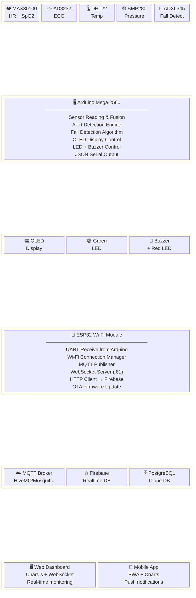

# System Block Diagram

## Smart IoT-Based Health Monitoring & Emergency Alert System

---

## High-Level Block Diagram

```
┌─────────────────────────────────────────────────────────────────────────┐
│                    SMART HEALTH MONITORING SYSTEM                        │
│                                                                          │
│  ┌──────────────────────────────────────────────────────────────────┐  │
│  │                        INPUT SENSORS                              │  │
│  │                                                                    │  │
│  │  ┌─────────┐  ┌─────────┐  ┌─────────┐  ┌─────────┐            │  │
│  │  │MAX30100 │  │ AD8232  │  │  DHT22  │  │  BMP280 │            │  │
│  │  │  Heart  │  │   ECG   │  │  Temp.  │  │Pressure │            │  │
│  │  │Rate+SpO2│  │ Monitor │  │ Humidity│  │Altitude │            │  │
│  │  └────┬────┘  └────┬────┘  └────┬────┘  └────┬────┘            │  │
│  │       │            │            │             │                   │  │
│  │  ┌────┴────┐  ┌────┴────┐  ┌───┴─────┐       │                  │  │
│  │  │ ADXL345 │  │Vibration│  │   LDR   │       │                  │  │
│  │  │  Fall   │  │ Sensor  │  │  Light  │       │                  │  │
│  │  │Detector │  │         │  │ Sensor  │       │                  │  │
│  │  └────┬────┘  └────┬────┘  └────┬────┘       │                  │  │
│  └───────┼────────────┼────────────┼────────────-┼──────────────────┘  │
│          │            │            │             │                       │
│          ▼            ▼            ▼             ▼                       │
│  ┌───────────────────────────────────────────────────────────────────┐  │
│  │               PROCESSING UNIT (Arduino Mega 2560)                 │  │
│  │                                                                    │  │
│  │   ┌──────────────┐   ┌──────────────┐   ┌───────────────────┐   │  │
│  │   │  Data        │   │   Alert      │   │    Output         │   │  │
│  │   │  Acquisition │──▶│  Detection   │──▶│    Control        │   │  │
│  │   │  & Fusion    │   │  Engine      │   │                   │   │  │
│  │   └──────────────┘   └──────────────┘   │  • OLED Display  │   │  │
│  │                                         │  • Green LED      │   │  │
│  │   ┌──────────────┐   ┌──────────────┐   │  • Red LED       │   │  │
│  │   │  Fall        │   │  Threshold   │   │  • Buzzer        │   │  │
│  │   │  Detection   │   │  Comparison  │   └───────────────────┘   │  │
│  │   │  Algorithm   │   │  Logic       │                            │  │
│  │   └──────────────┘   └──────────────┘                            │  │
│  │                                                                    │  │
│  │                      ┌──────────────┐                             │  │
│  │                      │  JSON Serial │──── UART (115200) ────▶    │  │
│  │                      │  Formatter   │                             │  │
│  │                      └──────────────┘                             │  │
│  └────────────────────────────────────────────────────────────────────┘  │
│                                  │ UART                                  │
│                                  ▼                                        │
│  ┌───────────────────────────────────────────────────────────────────┐  │
│  │               IoT GATEWAY (ESP32 Wi-Fi Module)                    │  │
│  │                                                                    │  │
│  │   ┌───────────┐   ┌──────────┐   ┌──────────┐   ┌────────────┐  │  │
│  │   │  UART RX  │──▶│  JSON    │──▶│  Wi-Fi   │──▶│  MQTT      │  │  │
│  │   │ Receiver  │   │  Parser  │   │  Stack   │   │  Publisher │  │  │
│  │   └───────────┘   └──────────┘   └──────────┘   └────────────┘  │  │
│  │                                       │                           │  │
│  │   ┌───────────┐   ┌──────────┐        │         ┌────────────┐  │  │
│  │   │  OTA      │   │  HTTP    │◀───────┤         │ WebSocket  │  │  │
│  │   │  Updates  │   │  Client  │        │         │  Server    │  │  │
│  │   └───────────┘   └──────────┘        │         └────────────┘  │  │
│  └───────────────────────────────────────┼─────────────────────────┘  │
│                                          │                              │
└──────────────────────────────────────────┼──────────────────────────────┘
                                           │ TCP/IP (Wi-Fi)
              ┌────────────────────────────┼─────────────────────────────────┐
              │                            ▼               CLOUD LAYER        │
              │    ┌──────────────────────────────────────────────────────┐  │
              │    │               MQTT Broker                             │  │
              │    │          broker.hivemq.com:1883                      │  │
              │    │                                                       │  │
              │    │  Topics: smarthealth/vitals                          │  │
              │    │          smarthealth/alerts                          │  │
              │    │          smarthealth/device/status                   │  │
              │    └───────────────────┬──────────────────────────────────┘  │
              │                        │                                      │
              │          ┌─────────────┼───────────────┐                     │
              │          ▼             ▼               ▼                     │
              │   ┌───────────┐  ┌──────────┐  ┌──────────────┐            │
              │   │PostgreSQL │  │ Firebase │  │Notification  │            │
              │   │ Database  │  │ RTDB     │  │   Service    │            │
              │   └───────────┘  └──────────┘  └──────────────┘            │
              │          │             │               │                     │
              │          ▼             ▼               ▼                     │
              │   ┌────────────────────────────────────────────────────┐   │
              │   │                   END USERS                         │   │
              │   │  ┌────────────────┐    ┌─────────────────────────┐ │   │
              │   │  │  Web Dashboard │    │     Mobile App          │ │   │
              │   │  │  (Browser)     │    │ (PWA / Android / iOS)   │ │   │
              │   │  └────────────────┘    └─────────────────────────┘ │   │
              │   └────────────────────────────────────────────────────┘   │
              └────────────────────────────────────────────────────────────┘
```

---

## Mermaid Block Diagram



---

## Functional Blocks Description

### Block 1: Input Sensor Array
| Sensor    | Measurement        | Interface | Sample Rate |
|-----------|--------------------|-----------|-------------|
| MAX30100  | HR (BPM), SpO2 (%)| I2C       | 50 Hz       |
| AD8232    | ECG (mV)           | Analog    | 100 Hz      |
| DHT22     | Temp (°C), RH (%)  | 1-Wire    | 0.5 Hz      |
| BMP280    | Pressure (hPa), Alt| I2C       | 0.5 Hz      |
| ADXL345   | Accel X/Y/Z (g)    | I2C       | 100 Hz      |
| Vibration | Digital vibration  | Digital   | Polling     |
| LDR       | Light (%)          | Analog    | 5 Hz        |

### Block 2: Arduino Mega Processing
- **Data Fusion:** Combines raw sensor readings into health metrics
- **Fall Algorithm:** Free-fall detection followed by impact spike
- **Alert Engine:** Threshold comparison with multi-condition logic
- **OLED Driver:** Rotating 3-page display at 2 Hz

### Block 3: ESP32 Gateway
- **Serial RX:** Parses newline-delimited JSON from Arduino
- **MQTT:** QoS 0 publish to broker (configurable QoS 1/2)
- **WebSocket:** Broadcasts to all connected dashboard clients
- **HTTP:** REST POST to Firebase for persistent storage

### Block 4: Cloud + Applications
- **MQTT Broker:** Decouples publishers from subscribers
- **Database:** Time-series storage with indexed queries
- **Dashboard:** Real-time charts via WebSocket + historical data
- **Mobile:** PWA with offline capability and push notifications
